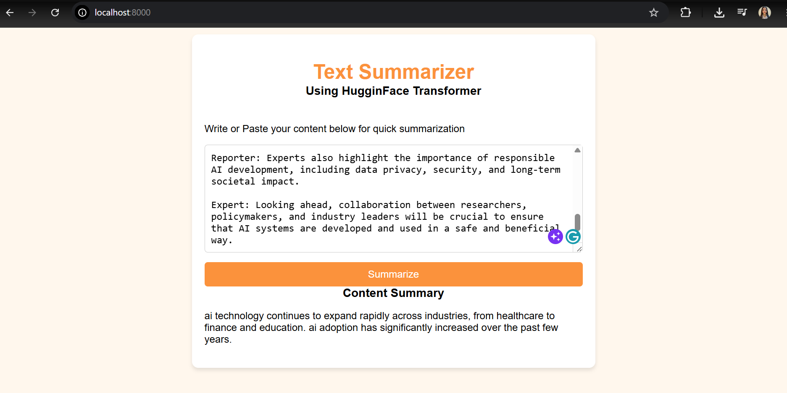

# 📝 Text Summarizer Application

An end-to-end NLP application that generates concise summaries from conversational text using a fine-tuned **T5-Small Transformer** model. The model is trained on the **SAMSum dataset** and served through a **FastAPI** backend with a lightweight **HTML, CSS, and JavaScript** frontend.

---

## 🚀 Overview

This project demonstrates how transformer-based language models can be fine-tuned and deployed as a production-ready web application.

Users can enter conversational text through a simple web interface and receive an AI-generated summary in real time.

### Key Highlights

* Fine-tuned **T5-Small** model from Hugging Face Transformers
* Trained on the **SAMSum Dialogue Summarization Dataset**
* REST API built using **FastAPI**
* Served using **Uvicorn**
* Interactive frontend using **HTML, CSS, and JavaScript**
* GPU/MPS/CPU device detection for inference
* End-to-end workflow from model training to deployment

---

## 🏗️ System Architecture

```text
┌─────────────────────┐
│     User Input      │
└──────────┬──────────┘
           │
           ▼
┌─────────────────────┐
│ HTML / CSS / JS UI  │
└──────────┬──────────┘
           │ REST API
           ▼
┌─────────────────────┐
│      FastAPI        │
│   (Backend API)     │
└──────────┬──────────┘
           │
           ▼
┌─────────────────────┐
│ Fine-Tuned T5-Small │
│ Hugging Face Model  │
└──────────┬──────────┘
           │
           ▼
┌─────────────────────┐
│ Generated Summary   │
└─────────────────────┘
```

---

## 📚 Dataset

### SAMSum Dataset

The model was fine-tuned using the **SAMSum** dataset, a benchmark dataset designed for dialogue summarization.

Features:

* Messenger-style conversations
* Human-written summaries
* Real-world conversational language
* Ideal for abstractive summarization tasks

Demo:
<p align="center">
  
</p>

---

## 🤖 Model Training

The project utilizes the pre-trained **T5-Small** sequence-to-sequence transformer model and fine-tunes it on the SAMSum dataset.

### Training Pipeline

1. Load SAMSum dataset
2. Clean and preprocess dialogue data
3. Tokenize dialogues and summaries
4. Fine-tune T5-Small using Hugging Face Transformers
5. Save trained model artifacts
6. Deploy model through FastAPI

### Model

```python
from transformers import T5ForConditionalGeneration

model = T5ForConditionalGeneration.from_pretrained("t5-small")
```

### Tokenizer

```python
from transformers import T5Tokenizer

tokenizer = T5Tokenizer.from_pretrained("t5-small")
```

---

## 💻 Technology Stack

### Machine Learning

* Python
* PyTorch
* Hugging Face Transformers
* T5-Small
* SAMSum Dataset

### Backend

* FastAPI
* Pydantic
* Uvicorn

### Frontend

* HTML5
* CSS3
* JavaScript (Vanilla JS)

### Development Environment

* Jupyter Notebook
* Git & GitHub

---

## 📂 Project Structure

```text
text-summarizer/
│
├── app.py
├── index.html
├── text_summarizer.ipynb
│
├── saved_summary_model/
│   ├── config.json
│   ├── generation_config.json
│   ├── model.safetensors
│   └── tokenizer files
│
├── requirements.txt
├── .gitignore
└── README.md
```


## 🎯 Learning Objectives

This project helped explore:

* Transformer Architecture
* Encoder-Decoder Models
* Transfer Learning
* Text Summarization
* Hugging Face Transformers
* Model Fine-Tuning
* FastAPI Development
* Frontend-Backend Integration
* Model Deployment

---


## 👨‍💻 Author

**Shreya Verma**

Deep Learning & Natural Language Processing Project

Built using Hugging Face Transformers, FastAPI, and modern web technologies to demonstrate transformer-based abstractive text summarization.
